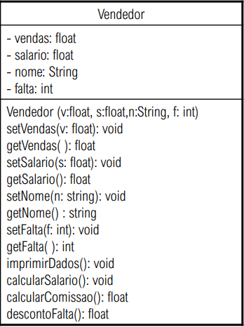

# Vendedor

  #UML
  
  
  
  # Funcionalidades:
  
    # - O método imprimirDados imprime o estado do objeto;
    # - O método calcularComissao deverá retornar o valor da comissão, conforme as regras a seguir:
      # i) venda igual ou acima de 1.000 e menor que 2.000 bônus de 10% sobre o valor das vendas.
      # ii) venda maior ou igual a 2.000 bônus de 15% sobre o valor das vendas.
    # - O método descontoFalta deverá calcular o desconto das faltas conforme o critério: desconto=(salario/30)*falta
    # - O método calcularSalario deverá atender ao critério: salario=(salario+comissao-descontoFalta)
